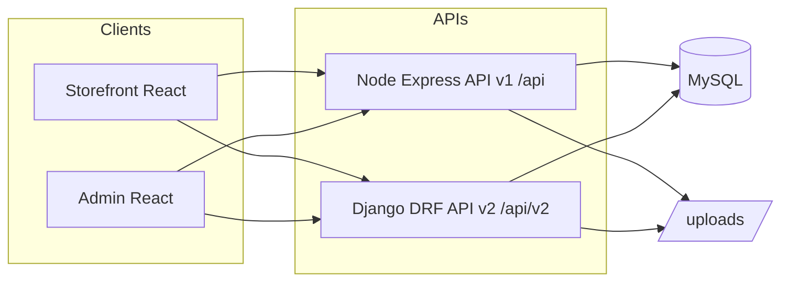
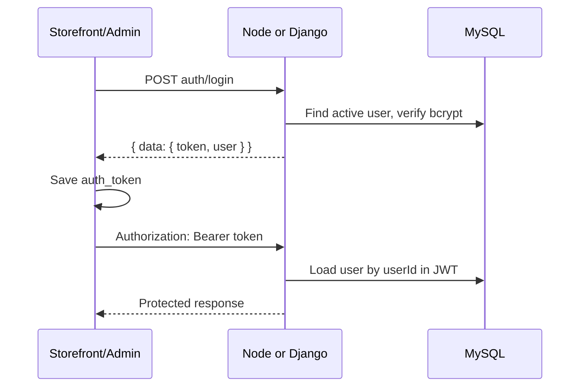
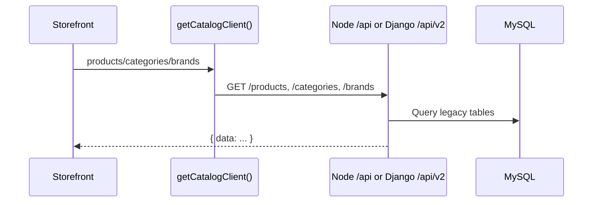
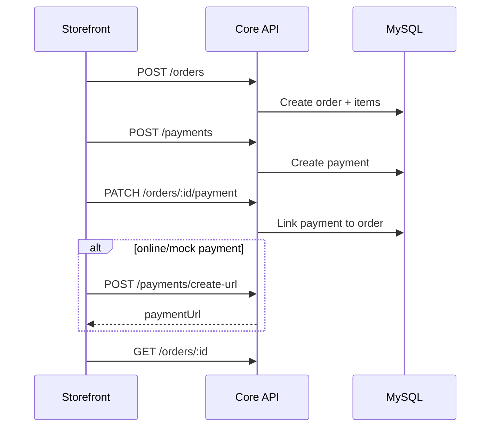
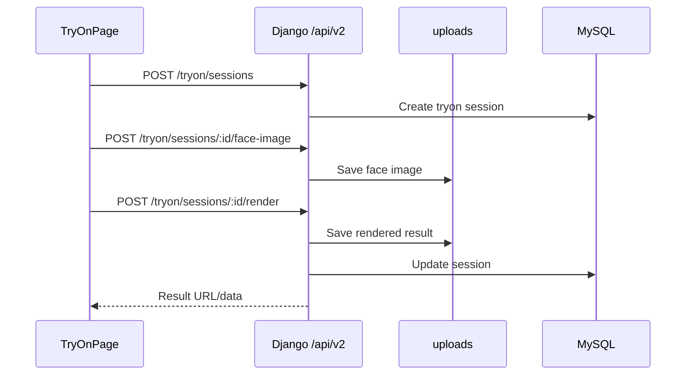
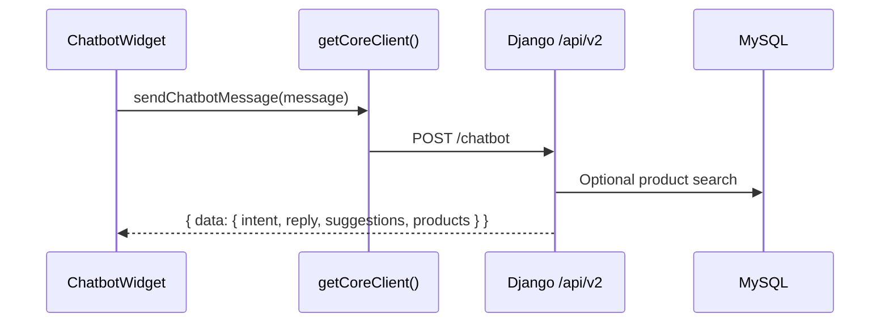
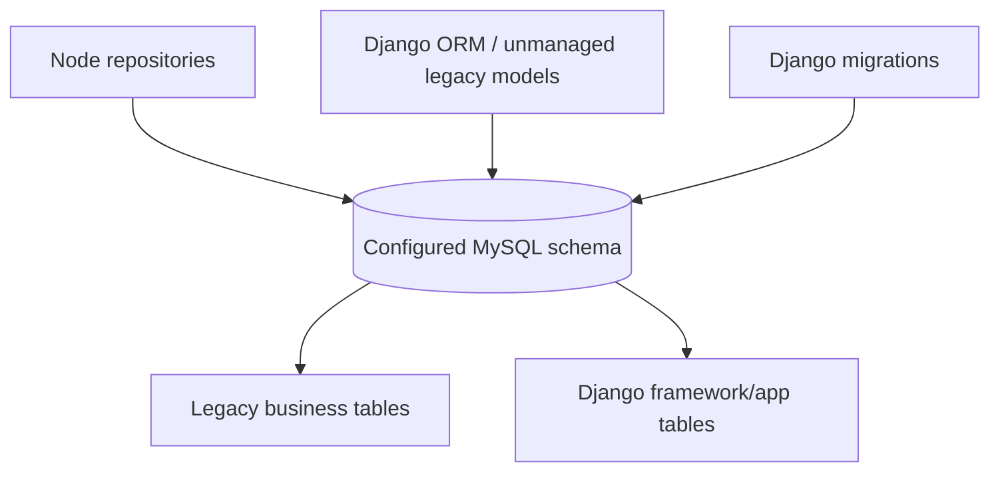
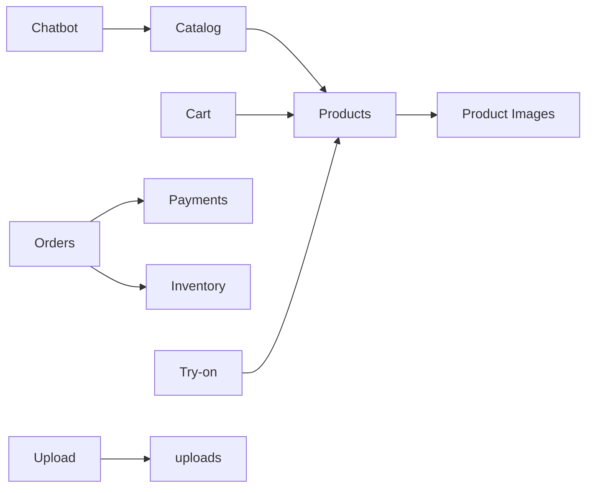

# System architecture - Website ban kinh mat (PRJ)

Cap nhat ngay 2026-05-22. Tai lieu nay tap trung vao luong he thong: client, API, auth, DB, order/payment, try-on, chatbot va trang thai migration.

## 1. Tong quan

- Storefront quyet dinh Node hay Django bang `VITE_USE_API_V2_CATALOG` va `VITE_USE_API_V2_CORE`.
- Admin mac dinh dung Node, co the doc catalog tu Django neu bat flag.
- DB la MySQL dung chung, khong co read model rieng.
- File media local nam trong `uploads/`.
- Khong co event bus/message queue. Moi workflow hien tai la request/response dong bo.

## 2. API surface

### Node v1

Mount tai `/api`, gom cac resource trong `Server/src/routes/index.ts`:

`auth`, `roles`, `users`, `categories`, `brands`, `suppliers`, `products`, `inventory`, `inventory-transactions`, `orders`, `payments`, `carts`, `reports`, `upload`.

Mot so resource con duoc mount long:

- `brands/:brandId/images`
- `products/:productId/images`
- `orders/:orderId/items`
- `carts/:cartId/items`

Node cung serve:

- `GET /health`
- static `/uploads`
- static `/product_img`

### Django v2

Mount tai `/api/v2`, dinh nghia trong `PythonServer/apps/api_v2/urls.py`:

- Auth/users/roles: login, admin login, register, logout, me, users, roles.
- Catalog: categories, brands, suppliers, products, product images.
- Commerce: carts, cart items, orders, order items, payments, inventory, reports.
- Upload: `POST /upload`.
- Try-on: sessions, face image upload, render.
- Chatbot: `POST /chatbot`.
- Payment mock URL: `POST /payments/create-url`.

Docs va health:

- `GET /api/docs/`
- `GET /api/schema/`
- `GET /health`

## 3. Auth flow

JWT legacy:

- Algorithm: HS256.
- Payload: `userId`, `username`, `roleId`, `exp`.
- Storefront luu token tai localStorage key `auth_token`.
- Admin/staff login chi cho role admin hoac staff.
- Logout la stateless, chu yeu xoa token client.

Diem quan trong:

- Node ky bang `JWT_SECRET`.
- Django ky/verify bang `DJANGO_SECRET_KEY`.
- Neu client login Node roi goi Django, 2 secret phai trung nhau.

## 4. Catalog flow

- Catalog v2 Django phu thuoc cac bang legacy (`products`, `categories`, `brands`, `suppliers`, `product_images`).
- Neu MySQL 8 chi co bang Django migrate ma chua import data legacy, catalog se loi hoac rong.
- Anh san pham la duong dan tu DB, client ghep voi `VITE_FILE_BASE_URL`.

## 5. Cart / order / payment flow

Storefront order flow nam trong `Frontend/eyewear-store/src/services/orders.service.ts`.

Trang thai hien tai:

- Node co logic order/payment/inventory day du hon, co side effect lien quan ton kho va status.
- Django commerce co logic don gian hon, can tiep tuc doi chieu parity neu dung thay Node.
- `POST /payments/create-url` chi co tren Django v2. Neu `VITE_USE_API_V2_CORE=0`, flow payment online co the khong co endpoint.
- Payment URL hien la mock redirect, khong phai VNPay/MoMo/webhook that.

## 6. Try-on flow

- Try-on nam trong Django app `tryon`.
- Bang `tryon_sessions` duoc tao boi Django migration.
- Xu ly anh dung OpenCV/Mediapipe/Pillow va chay dong bo trong request.
- Anh try-on nam trong `uploads/tryon/...`.

## 7. Chatbot flow

Trang thai:

- UI: `Frontend/eyewear-store/src/components/ChatbotWidget.tsx`.
- Service: `Frontend/eyewear-store/src/services/chatbot.service.ts`.
- Backend: `PythonServer/apps/chatbot/views.py` va `service.py`.
- Chatbot rule-based, khong dung LLM/API ngoai.
- Intent hien co gom: rong, mat tron, mat vuong, kinh can/may tinh, kinh mat/di nang, phu kien, tam gia, bao hanh, doi tra, giao hang, thanh toan, search/fallback.
- Chatbot doc catalog DB de goi y san pham con hang. Vi no goi `products_queryset()`, DB legacy phai co bang san pham.
- Vi storefront goi chatbot qua `getCoreClient()`, can bat `VITE_USE_API_V2_CORE=1` hoac bo sung endpoint `/chatbot` tren Node neu muon core Node.

## 8. DB flow

- Node repository truy van SQL truc tiep.
- Django doc legacy tables qua model/view tuong ung va tao bang rieng cho app can migration.
- MySQL 8 la huong khuyen nghi cho Django 5.
- MariaDB 10.4 XAMPP chi nen xem la nguon data legacy de dump/import.

Can kiem tra sau import:

- `products`
- `product_images`
- `categories`
- `brands`
- `suppliers`
- `users`
- `roles`
- `carts`, `cart_items`
- `orders`, `order_items`
- `payments`
- `inventory`, `inventory_transactions`

## 9. Module dependencies

Diem de y:

- Sua schema/product fields co the anh huong catalog, cart, order, chatbot, try-on.
- Sua payment/order status co the anh huong inventory va admin reports.
- Sua file URL/upload can test ca Node static, Django media, storefront `VITE_FILE_BASE_URL`.

## 10. Observability va verification

- Node health: `GET /health`.
- Django health: `GET /health`.
- Django log co `request_id` qua `RequestIdMiddleware`.
- Test co san:
  - `PythonServer/tests/test_api_contract.py`
  - `migration/validation/contract_smoke.py`
  - `migration/validation/shadow_compare.py`

Checklist truoc khi merge/su dung:

1. Build Node: `npm run build` trong `Server/`.
2. Build storefront: `npm run build` trong `Frontend/eyewear-store/`.
3. Build admin: `npm run build` trong `Backend/`.
4. Django check: `PythonServer\.venv\Scripts\python PythonServer\manage.py check`.
5. Smoke test: health, products, login, cart/order, payment result, chatbot, try-on.
